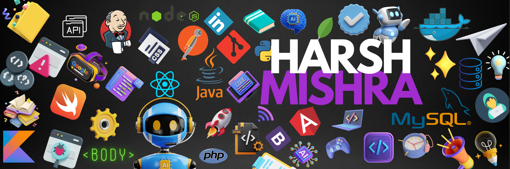

  

 
 
 

I am Harsh Mishra, a passionate Developer and open-source contributor.
I am always looking for opportunities to collaborate on new and innovative ideas. To know more about me, please feel free to connect with me.

 
 
 

  

## 🌐 Socials:

# 💻 Tech Stack:
  

      

 

## GSSOC 2024 Badges 

 

 ## HACKTOBERFEST 2023 Badges
- 

# 📊 GitHub Stats:

